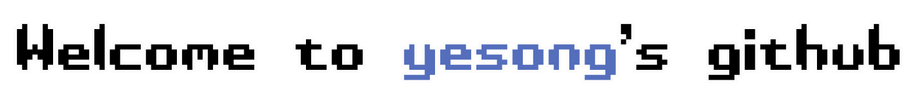

&nbsp;&nbsp;&nbsp;&nbsp;&nbsp;&nbsp;

  

 

  👩🏻‍💻 <b>Frontend & VR Developer</b> 
  🏫 <b>Inha-University (Dept. of Design Technology)</b>

  <table>
    <tr>
      <td valign="top">
        
      </td>
      <td valign="top">
         
        
        
        
        
         
        
        
        
         
        
        
      </td>
    </tr>
  </table>

<!--

-->

<!--
<table>
  <tr>
    <td>
      
    </td>
    <td style="vertical-align: middle; padding-left: 20px;">
      
My commit activity : 
      👉🏻 <a href="https://gist.github.com/yesongO/0f0512cc54d913453025a3b17c235dc6" target="_blank">am I a daydreamer or night owl? 🦉✨</a>

    </td>
  </tr>
</table>
-->

<!--

commit activity here:  
👉 [Commit Activity Gist](https://gist.github.com/yesongO/0f0512cc54d913453025a3b17c235dc6)
## ☀️🌃 Commit Activity 

**yesongO/yesongO** is a ✨ _special_ ✨ repository because its `README.md` (this file) appears on your GitHub profile.
Here are some ideas to get you started:

- 🔭 I’m currently working on ...
- 🌱 I’m currently learning ...
- 👯 I’m looking to collaborate on ...
- 🤔 I’m looking for help with ...
- 💬 Ask me about ...
- 📫 How to reach me: ...
- 😄 Pronouns: ...
- ⚡ Fun fact: ...

-->
